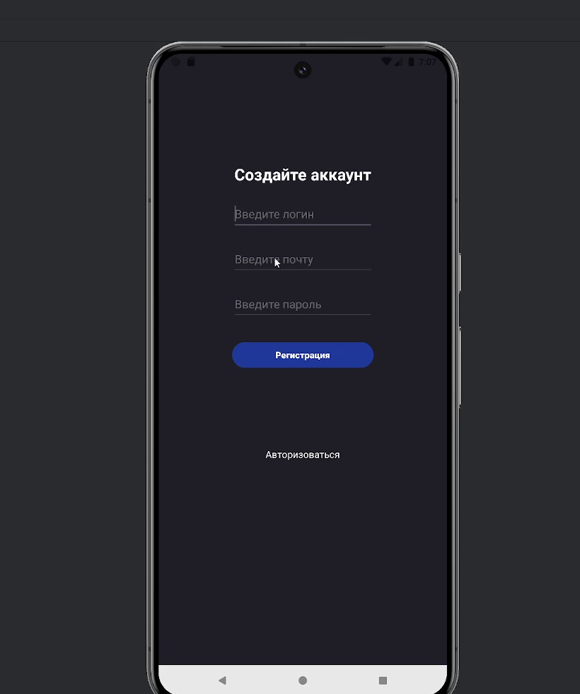
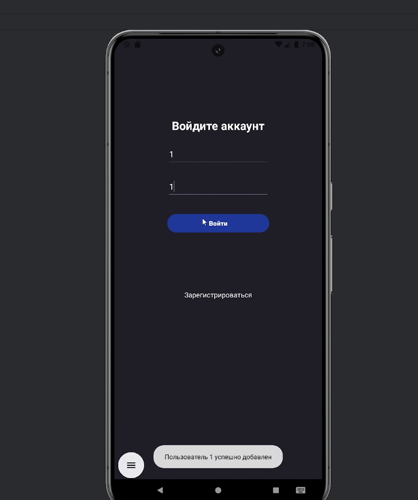
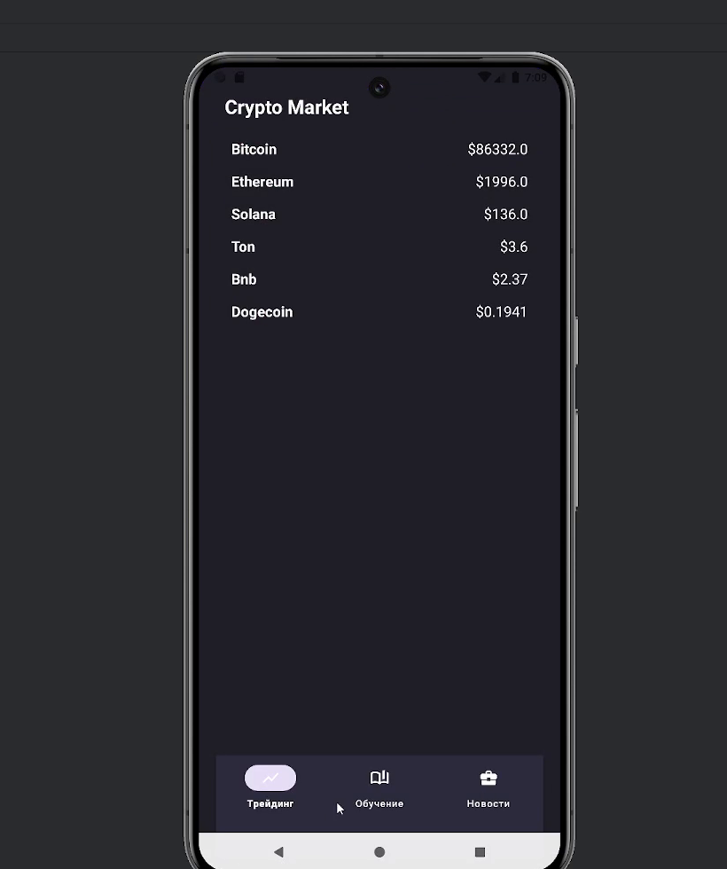
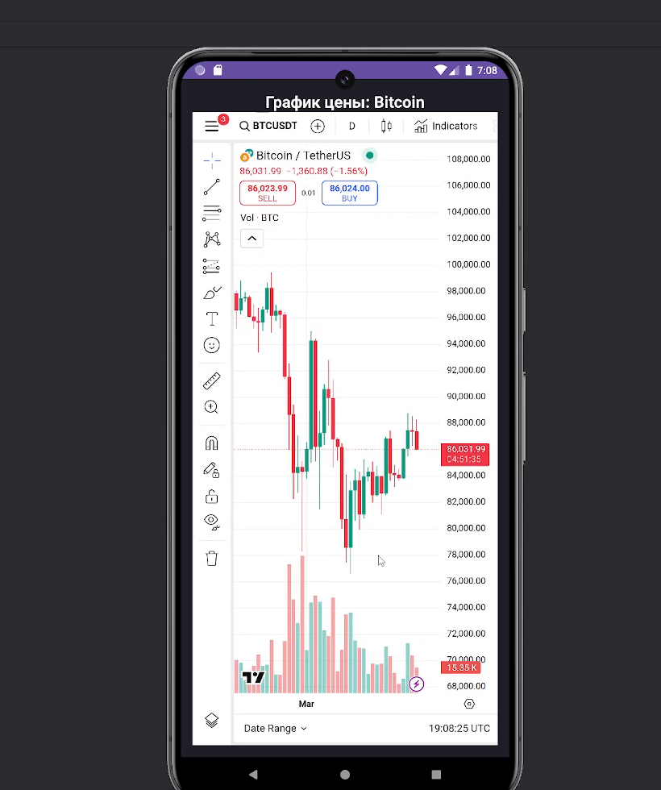
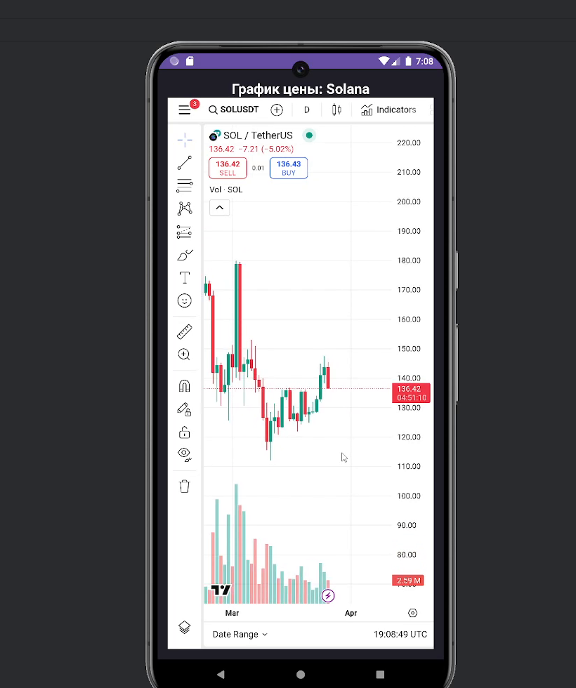
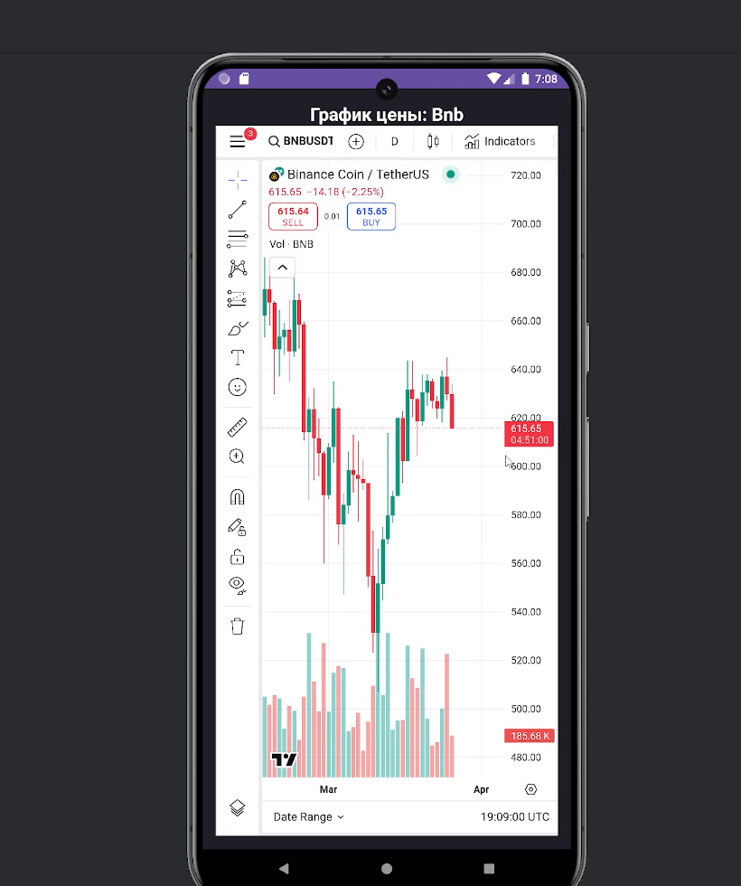
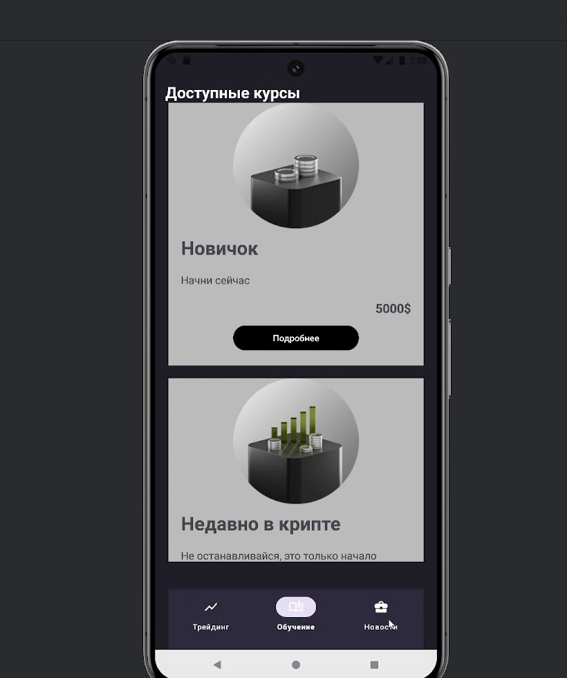
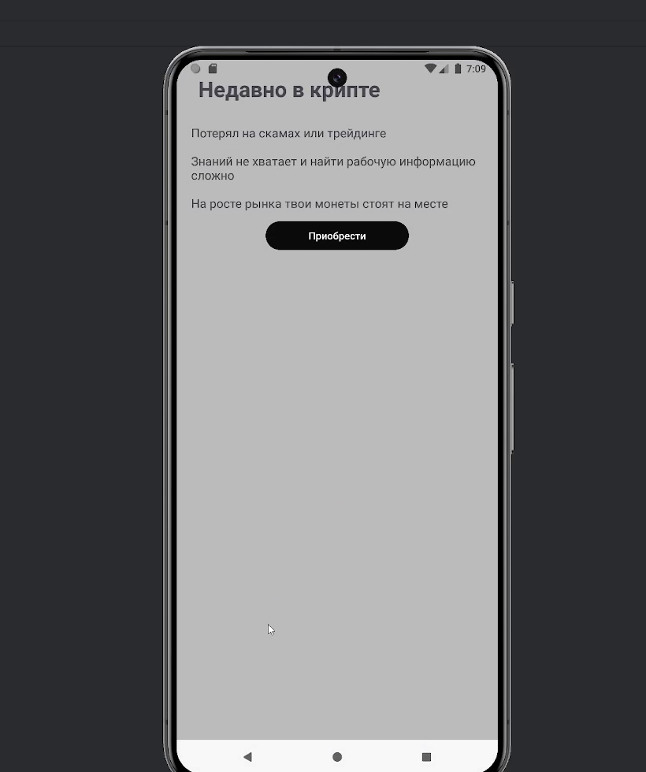

# LuminaryTrading

> Android-приложение для отслеживания криптовалют, изучения трейдинга и работы с курсами обучения. Тёмная тема, котировки в реальном времени, интерактивные графики и встроенный обучающий контент.


---

## Содержание

- [О проекте](#о-проекте)
- [Возможности](#возможности)
- [Скриншоты](#скриншоты)
- [Технологический стек](#технологический-стек)
- [Архитектура](#архитектура)
- [Структура проекта](#структура-проекта)
- [Запуск проекта](#запуск-проекта)
- [Внешние сервисы](#внешние-сервисы)
- [Дальнейшее развитие](#дальнейшее-развитие)
- [Автор](#автор)

---

## О проекте

**LuminaryTrading** — учебный pet-проект, в котором собран практически полный пользовательский путь крипто-приложения: от регистрации и аутентификации до просмотра котировок, интерактивных графиков и обучающих курсов.

Цель проекта — на практике освоить современный стек Android-разработки: Kotlin, MVVM, корутины, Retrofit, Room, ViewBinding и работу с реальным REST API.

---

## Возможности

| Модуль | Что делает |
|---|---|
| **Аутентификация** | Регистрация (логин / e-mail / пароль) и вход существующего пользователя. Локальное хранение учётных записей. |
| **Crypto Market** | Список ключевых криптовалют (Bitcoin, Ethereum, Solana, TON, BNB, Dogecoin) с актуальными ценами в USD. |
| **График цены** | Подробный экран по каждой монете: интерактивный свечной график, объёмы, индикаторы, инструменты разметки. |
| **Обучение** | Каталог обучающих курсов разного уровня сложности: «Новичок», «Недавно в крипте», «Опытный» и т.д. |
| **Карточка курса** | Описание курса, перечень проблем, которые он решает, и кнопка покупки. |
| **Новости** | Раздел новостей криптовалютного рынка. |
| **Bottom Navigation** | Удобное переключение между разделами: Трейдинг / Обучение / Новости. |

---

## Скриншоты

<table>
  <tr>
    <td align="center"><b>Регистрация</b></td>
    <td align="center"><b>Авторизация</b></td>
    <td align="center"><b>Crypto Market</b></td>
  </tr>
  <tr>
    <td></td>
    <td></td>
    <td></td>
  </tr>
  <tr>
    <td align="center"><b>График Bitcoin</b></td>
    <td align="center"><b>График Solana</b></td>
    <td align="center"><b>График BNB</b></td>
  </tr>
  <tr>
    <td></td>
    <td></td>
    <td></td>
  </tr>
  <tr>
    <td align="center"><b>Доступные курсы</b></td>
    <td align="center"><b>Карточка курса</b></td>
    <td></td>
  </tr>
  <tr>
    <td></td>
    <td></td>
    <td></td>
  </tr>
</table>

---

## Технологический стек

**Язык и платформа**
- Kotlin
- Android SDK 24–34
- Material Components 1.12

**Архитектура и асинхронность**
- MVVM (ViewModel + Repository)
- Kotlin Coroutines + StateFlow
- Lifecycle-aware components

**Сеть**
- Retrofit 2 + Gson Converter
- OkHttp + HttpLoggingInterceptor

**Хранение данных**
- Room (DAO, Entity, TypeConverter для `Date`)

**UI**
- ViewBinding и DataBinding
- ConstraintLayout, RecyclerView
- Bottom Navigation View
- Glide — загрузка и кеширование изображений
- SparkLineLayout — компактные мини-графики в карточках

**Сборка**
- Gradle Kotlin DSL (`build.gradle.kts`)
- Version catalog (`libs.versions.toml`)
- KAPT для Room

---

## Архитектура

Приложение построено по схеме **MVVM с разделением слоёв**:

```
┌─────────────────────────────────────────────┐
│                    UI Layer                 │
│   Activity  ──►  ViewBinding  ──►  Adapter  │
└─────────────────────┬───────────────────────┘
                      │ collectLatest (StateFlow)
┌─────────────────────▼───────────────────────┐
│                  ViewModel                  │
│   CryptoViewModel  (StateFlow, viewModelScope)
└─────────────────────┬───────────────────────┘
                      │
┌─────────────────────▼───────────────────────┐
│                Repository                   │
│   CryptoRepository  (бизнес-логика)         │
└──────────┬──────────────────────┬───────────┘
           │                      │
┌──────────▼──────────┐  ┌────────▼─────────┐
│  Remote (Retrofit)  │  │  Local (Room)    │
│  CoinGeckoService   │  │  TradeDatabase   │
└─────────────────────┘  └──────────────────┘
```

- **Activity / Adapter** работают только с готовыми данными из ViewModel и не знают про источники.
- **ViewModel** держит UI-состояние в `StateFlow`, переживает повороты экрана.
- **Repository** инкапсулирует логику получения данных: сначала проверка кеша, при необходимости — запрос к API.
- **CoinGeckoService** описывает REST-эндпоинты через аннотации Retrofit.
- **TradeDatabase** хранит сделки и пользовательский портфель локально.

---

## Структура проекта

```
LuminaryTrading/
├── app/
│   ├── src/main/
│   │   ├── java/com/example/luminarytrading/
│   │   │   ├── Activity/         # Экраны: Splash, Main, Detail, Study, Gifts, Portfolio
│   │   │   ├── Adapter/          # RecyclerView-адаптеры (CryptoAdapter, StockAdapter)
│   │   │   ├── Model/            # Data-классы (CryptoModel, Model)
│   │   │   ├── Repository/       # CryptoRepository, MainRepository
│   │   │   ├── api/              # CoinGeckoService (Retrofit-интерфейс)
│   │   │   ├── database/         # TradeDatabase, TradeDao, Converters
│   │   │   ├── viewmodel/        # CryptoViewModel
│   │   │   └── LuminaryTradingApp.kt   # Application — DI вручную
│   │   ├── res/
│   │   │   ├── layout/           # XML-разметка экранов и item'ов RecyclerView
│   │   │   ├── drawable/         # Иконки, фоны, лого монет
│   │   │   ├── menu/             # bottom_nav_menu.xml
│   │   │   └── values/           # colors, strings, themes
│   │   ├── assets/               # Текстовые материалы для обучающих статей
│   │   └── AndroidManifest.xml
│   └── build.gradle.kts
├── gradle/
│   └── libs.versions.toml        # Version Catalog
├── screenshots/                  # Демонстрационные скриншоты приложения
├── build.gradle.kts
├── settings.gradle.kts
└── README.md
```

---

## Запуск проекта

### Требования

- Android Studio **Hedgehog** (2023.1) или новее
- JDK **11+**
- Android SDK **34**
- Эмулятор API 24+ или физическое Android-устройство

### Шаги

```bash
# 1. Клонировать репозиторий
git clone https://github.com/neiro22/LuminaryTrading.git
cd LuminaryTrading

# 2. Открыть проект в Android Studio
# File → Open → выбрать папку LuminaryTrading

# 3. Дождаться окончания Gradle Sync

# 4. Запустить на устройстве/эмуляторе
./gradlew installDebug
```

или из Android Studio — кнопка **Run ▶**.

> Приложение требует разрешение `INTERNET` для запросов к публичному API CoinGecko.

---

## Внешние сервисы

Приложение использует **[CoinGecko API](https://www.coingecko.com/en/api)** — бесплатный REST-источник данных о криптовалютах.

Используемый эндпоинт:

```
GET https://api.coingecko.com/api/v3/simple/price
    ?ids=bitcoin,ethereum,solana,tron,binancecoin,dogecoin
    &vs_currencies=usd
    &include_24hr_change=true
```

Цены в приложении автоматически обновляются раз в **30 секунд** через корутину в `MainActivity`.

---

## Дальнейшее развитие

- [ ] Перевод DI на Hilt вместо ручной инициализации в `Application`
- [ ] Покрытие unit-тестами слоёв ViewModel и Repository
- [ ] Перевод UI на Jetpack Compose
- [ ] Поддержка нескольких портфелей и истории сделок
- [ ] Push-уведомления при изменении цены выше / ниже порога
- [ ] Локализация (English + Русский)
- [ ] CI на GitHub Actions: `./gradlew build` + lint + unit-тесты

---

## Автор

**Egor Rzhechkovskij**

- GitHub: [@neiro22](https://github.com/neiro22)

---

> Проект создан в учебных целях и используется как pet-project для портфолио.
